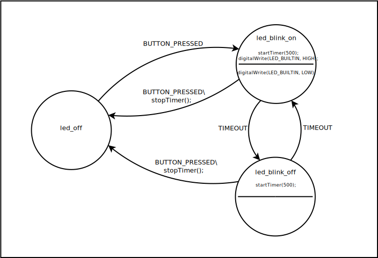

# Blink1

 In this example the LED blinks when the button is pressed. It demonstrates
 how entry, exit and transitions can be mixed to create an effective state
 machine. It also impliments a simple timer showing how to call functions
 in your sketch from the state machine.



## The State Machine Description

For the state machine to make use of the timer functions it is necessary to
provide it with the necessary function prototypes. Theese are in the header 
file `Blink1.h` which needs to be included. The contents of this header file
will be discused later. Also we have added the additional state and event 
to the header section of the description file.

```
%{
#include <Arduino.h>
#include "Blink1.h"
%}

%event BUTTON_PRESSED TIMEOUT
%state led_off led_blink_on led_blink_off 
%start led_off
```
The rules section of the file has to reflect the new state machine. The
`led_off` state has one out going transition when the button is pressed.

```
led_off
{
   BUTTON_PRESSED led_blink_on
}
```

The 'led_blink_on' state is much more complicated using entry, exit, 
and transition actions. The LED should light when ever the state is entered
and turn off when ever the state is left. The state machine should only
remain in this state for 500ms, after which time it should move to the 
`led_blink_off' state. If the button is pressed the timer should be 
cancled and the state machine should move to the `led_off` state.

```
led_blink_on
%entry
  %{
    startTimer(500);
    digitalWrite(LED_BUILTIN, HIGH);
  %}
%exit
  %{
    digitalWrite(LED_BUILTIN, LOW);
  %}
{
  BUTTON_PRESSED led_off
  %{
    stopTimer();
  %},
  TIMEOUT led_blink_off
}
```

The `led_blink_off` state is a less complicate version of the `led_blink_on`
state.

```
led_blink_off
%entry
  %{
    startTimer(500);
  %}
{
  BUTTON_PRESSED led_off
  %{
    stopTimer();
  %},
  TIMEOUT led_blink_on
}
```

## Arduino Sketch

The complete sketch is in the file `Blink1.ino`, I will only consider those
sections that a pertinate to this example. The biggest addition is the timer
routines. First it is necessary to add a variable holding the experation
time of the timer.

```c++
// Value of millis() when the timer expires.
unsigned long timeout = ULONG_MAX;
```

The timer implimentation is very simple. 

```c++
// Start the timer and set it to expire msecs milliseconds from now.
void startTimer(unsigned long msecs)
{
  timeout = millis() + msecs;
}

// Effectivally stop the timer by setting it to expire 50 days from
// now. 
void stopTimer()
{
  timeout = ULONG_MAX;
}

// Check the timer against millis() to see if it has expired. If
// so cancel the timer and return 1.
int checkTimer()
{
  if (timeout <= millis()) {
    timeout = ULONG_MAX;
    return 1;
  }
  return 0;
}
```

 