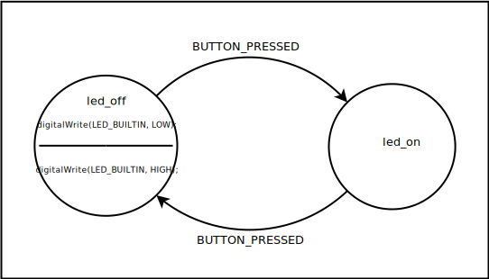

# Led2

This example functions the same as the [Led1](./Led1/README.md) except the
user defined code has been moved from the transition to state entry and exit
actions.



Any state can have code that will be executed whenever a transition causes
the state to be entered or left. These actions are shown in side the circle
representing the state on the state diagram. The code above the horizontal
line are the entry actions and the code below are the exit actions. If the
state only has entry actions the line will be still shown in the state, but
the area below the line will be empty. For states with only exit actions the
space above the line will be empty. When the state machine processes an
event the results in a state transition, the current state is first checked
for exit actions and if present these actions will be executed. Then any
actions associated with the transition are formed and the machine advances
to the new state. If there a any entry actions for the new state they are
performed.

## The State Machine Description

For this example the file remains the same except for the rules section.

```
led_on
{
   BUTTON_PRESSED led_off
}

led_off
  %entry %{ digitalWrite(LED_BUILTIN, LOW; %} 
  %exit  %{ digitalWrite(LED_BUILTIN, HIGH; %}
{
  BUTTON_PRESSED led_on
}
```
The entry and exit actions are place after the state name and before the
opening brace starting the transition list. The `%entry` keyword is use to
set the states entry actions and the and the `%exit` keyword is for the exit
actions.

## Arduino Sketch

The sketch is identical to the one used for the [Led1](./Led1/README.md)
example.

 

