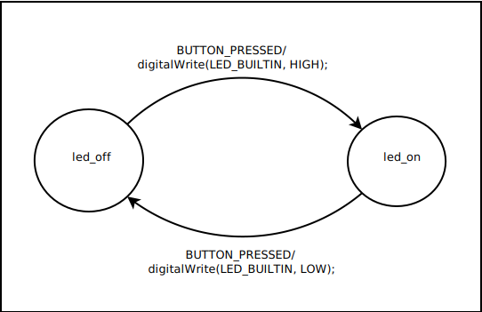

# Led 1

The first example is an extremely simple state machine with only two
states and a single event. Connect a push button switch between D2 of
the processor board and ground. When the button is pressed the on-board
LED will turn on. When it is pressed again the LED will turn off.


    
In the state diagram the states are represented as circles and the
transitions are arrows connecting the circles. By convention state
name are given in lower case and events are all upper case. The code
given after the event name is executed when ever the state
transition is made.

## The State Machine Description File

The state machine compiler processes an input file describing the state
machine and produces a `c++` class which implements the state machine.
The output is two files. A `c++` header with a `.h` extention
and a `c++` code file with a `.cpp` extension.

For this first example I named the state machine description file
`Led1Sm.sm`.

All keywords in the input file are proceeded by a `%`, such as `%class`. User
supplied code is enclosed between `%{` and `%}` and is copied to the output
file verbatim. The input file is divided into three sections separated by
`%%`. A header section containing options, a rules section containing
descriptions of the state transitions and an optional code section.
If the code section is omitted the final %% separator is not required.

```
[header]
%%
[rules]
%%
[code]
```


The header portion of the description file specifies code to be
included at the top of the output .h file along with options defining
the state machine

```
%{
#include <Arduino.h>;
%}

%event BUTTON_PRESSED
%state led_on led_off
%class Led1Sm
%start led_off
```
    
The code block at the start of the header section should be the first
thing in the section. This block is copied verbatim to the beginning of
the output .h file. In the example we are including Arduino.h for the
definition of the digitalWrite() function. The option %event is required
and list all of the events. Multiple %event options can be specified
adding additional events. The %state option is also required listing
all of the states. Like the %event option it can occur multiple times
in the header section. The %class option is optional and give the class
name for the generated class. The output header and code file name will
be generated by appending .h and .cpp to the class name. If the %class
option is omitted the class name will be the same as the input file name
with any file name extensions removed. The optional %start gives the
initial state for the state machine. If no start state is specified
the first state given in the rules section will be used as the start
    state.
    
The rules section describes the state transitions and attaches user code
to the transitions.

```c++
%%
led_on
{
  BUTTON_PRESSED led_off
  %{
    digitalWrite(LED_BUILTIN, LOW);
  %}
}
led_off
{
  BUTTON_PRESSED led_on
  %{
    digitalWrite(LED_BUILTIN, HIGH);
  %}
}
```

The rules section lists all of the possible states with a comma separated
list of transitions enclosed in `{...}`. The state machine for this example
has two states `led_on` and `led_off` each of which has a transition defined
for the `BUTTON_PRESSED` event. The format of a transition is the event name
followed by the next state and user supplied code to be executed for the
transition. Both the next state and user code are optional. If the next
state is omitted the state machine will remain in the current state.

Since there are no user defined member functions the last section along with
the `%%` separator can be omitted.

## Generating the State Machine Class

To create the state machine class file it is only necessary to run the
compiler on the description file. By convention the state machine
description files are given a .sm extension. The compiler takes an
optional argument to produce additional trace output as the state
machine description is parsed. This is mostly only useful as a developer
tool to debug the compiler.

    ascm [-t[trace-file]] infile

For our example the command is:

    ascm Led1Sm.sm

which will create the two files `Led1Sm.h` and `Led1Sm.cpp`.

## The Arduino Sketch File

After creating the state machine class files open the Arduino IDE and create
a new sketch and save it as Led1. Goto the Sketch menu and add the two
generated files Led1Sm.cpp and Led1Sm.h. Remember if you modify the state
machine description file you have to recompile the it and over write
the files into your sketch directory with the new versions.

```c++
#include <Button.h>

#include "Led1Sm.h"

#define BUTTON_PIN 2

Led1Sm sm;
Button button(BUTTON_PIN);

void setup()
{
  pinMode(LED_BUILTIN, OUTPUT);
  button.begin();
  sm.begin();
}

void loop()
{
  // Send an event to the state machine every time the button is pressed.
  if (button.pressed()) {
    sm.run(sm.BUTTON_PRESSED);
  }
}
```

Only four steps are necessary to interface the state machine with your
sketch.

1. Include the state machine header file in your sketch.

    #include "Led1Sm.h"

1. Create an instance of your state machine class.

    Led1Sm sm;

1. Initialize the state machine in your `setup()` function.

    begin.sm();

1. Call your state machine when an event of interest occurs.

    sm.run(sm.BUTTON_PRESSED);

Compile and download sketch.


